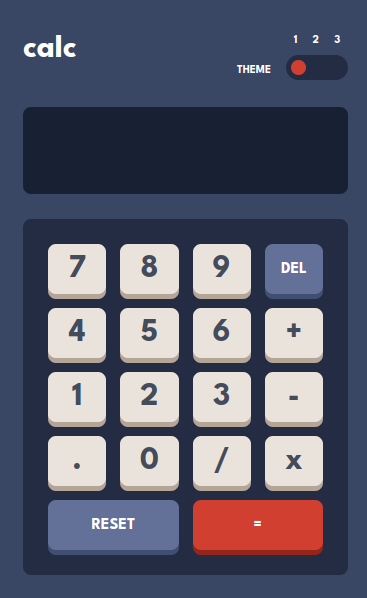
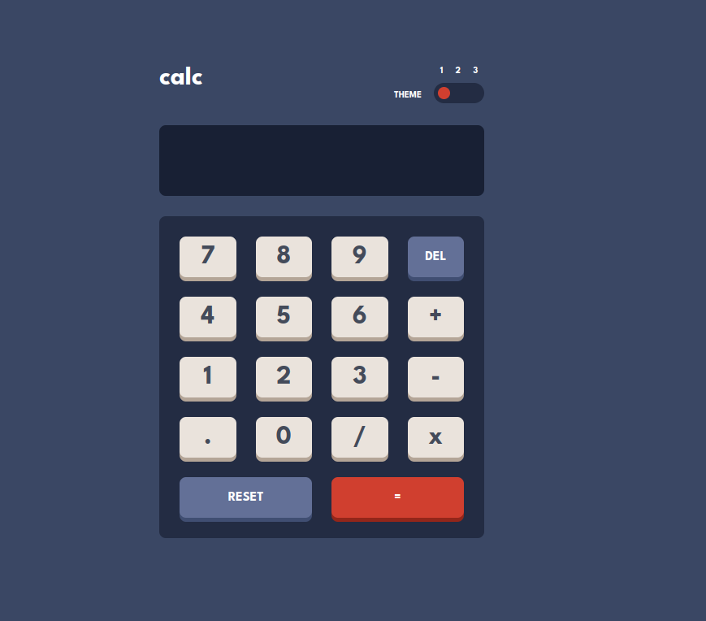
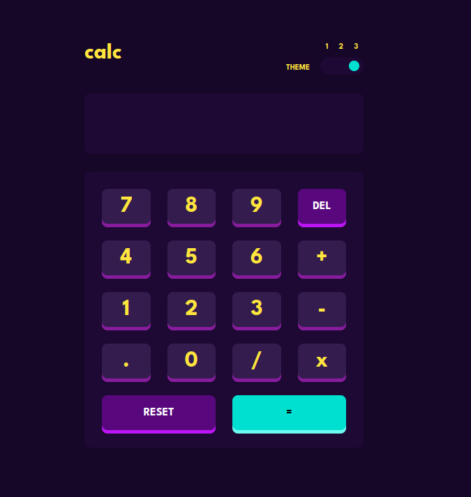

# Frontend Mentor - Calculator app solution

This is a solution to the [Calculator app challenge on Frontend Mentor](https://www.frontendmentor.io/challenges/calculator-app-9lteq5N29). Frontend Mentor challenges help you improve your coding skills by building realistic projects.

## Table of contents

- [Overview](#overview)
  - [Running the project](#run-project)
  - [The challenge](#the-challenge)
  - [Screenshot](#screenshot)
  - [Links](#links)
- [My process](#my-process)
  - [Built with](#built-with)
  - [What I learned](#what-i-learned)
  - [Useful resources](#useful-resources)
- [Author](#author)

## Overview

### Run project

After cloning this project using `git` you may want to do the following:

```sh
~/ npm i # In order to install all the dependencies
~/ npm test # To run the unit tests
~/ npm run e2e # To run cypress and the e2e tests
~/ npm run dev # In order to start a dev-server with hot-reloading
```

### The challenge

Users is be able to:

- See the size of the elements adjust based on their device's screen size
- Perform mathmatical operations like addition, subtraction, multiplication, and division
- Adjust the color theme based on their preference
- Persist selected theme after page reload

### Screenshot

#### Mobile view



#### Desktop view



#### Dark theme



### Links

- Solution URL: [Add solution URL here](https://your-solution-url.com)
- Live Site URL: [Add live site URL here](https://your-live-site-url.com)

## My process

### Built with

- Semantic HTML5 markup
- Flexbox
- CSS Grid
- Mobile-first workflow
- Vanilla JS
- SASS
- Parcel
- Jest
- Cypress

### What I learned

- Data structures (Stack)
- Expressions transformation and evaluation (infix to prefix _and_ prefix evaluation)
- Support multiple themes using SASS
- Pub/Sub pattern (to notify different components of theme changes)

### Useful resources

- [Infix to prefix converter](https://www.free-online-calculator-use.com/infix-to-prefix-converter.html) - This page explains with clear examples how to convert from info to prefix notation
- [Prefix expression evaluator](https://www.free-online-calculator-use.com/prefix-evaluator.html) - This page explains with clear examples how to evaluate an expression in prefix notation
- [SASS theming](https://medium.com/@dmitriy.borodiy/easy-color-theming-with-scss-bc38fd5734d1) - Provides a clever and simple way of supporting multiple themes if using SASS pre-processor

## Author

- Website - [Ruben](https://rsgarxia.is-a.dev)
